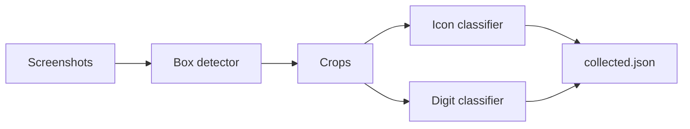

# Extract Pipeline Architecture

## Overview

This document outlines the architecture for moving from fake armor data to real game data: collecting screenshots from the game, retraining the neural networks that were never committed, and organizing all training data under a canonical layout. The pipeline is: **collect → locate box → split → classify** (icons + digits), producing the JSON used by the armor selection system.

## Three Steps to a Working Extract Pipeline

### 1. Source data

- A **screenshot collection script** captures images from the user’s screen while they play. See [scripts/SCREENSHOT_COLLECTION.md](scripts/SCREENSHOT_COLLECTION.md).
- The user triggers each capture with a key combination (e.g. **o** then **p**). Images are stored under `data/` according to the layout in [shared/DATA_LAYOUT.md](shared/DATA_LAYOUT.md).

### 2. Box detector

- A neural network takes a **full screenshot** and outputs the **top-left** of the gear/card box only. That top-left is **not** stored in config; it is computed at inference time by the model.
- Screenshot **type** (regular vs blueprint) is **not** predicted by the model; it is known from labeling (e.g. by placing images in `labeled/screenshots/regular/` or `labeled/screenshots/blueprint/` per [shared/DATA_LAYOUT.md](shared/DATA_LAYOUT.md)).
- Box dimensions and region layout are derived from config. The only values stored for extract layout are **two scale factors**: one for regular screenshots and one for blueprint (e.g. `EXTRACT_REGULAR_SCALE`, `EXTRACT_BLUEPRINT_SCALE` in .env). The front-end config UI lets users tune these so region overlays align; users copy the values into .env manually.
- Training uses a **limited initial labeled set** plus **ongoing labels from the front-end**; labeling and training happen in the same workflow.
- **Augmentation**: small translations of the image during training.
- A defined portion of labeled data is **reserved as a test set**.

### 3. Two image classifiers

- The legacy **image_splitter** is recreated (sizes and offsets from config, plus box type). It uses the box detector’s output (top-left) and the **user-provided type** (from the path or manifest) to crop regions from the screenshot.
- Those crops feed two classifiers, trained via the same **interactive labeling** process:
  - **Stat-type (icon)** classifier: which stat the icon represents.
  - **Stat-value (digit)** classifier: digit (and possibly “blob”) recognition.
- For each of these, a portion of labeled data is **reserved as a test set**.

## Training as a task

Neural network training runs as a **task** in the existing task worker (Redis-backed, same pattern as recommendation tasks). Details: [task/TRAINING_TASK.md](task/TRAINING_TASK.md).

## Data layout

All paths for unlabeled screenshots, labeled screenshots (with box coordinates), and labeled icons/numbers follow the structure in [shared/DATA_LAYOUT.md](shared/DATA_LAYOUT.md). Code in `api/`, `task/`, and `scripts/` should conform to that layout.

## Interactive labeling

Labels and corrections are provided from the **front-end**. The API persists them into the `data/labeled/` tree. As more data is added, training can be re-run (e.g. by enqueueing a training task). The system is designed so that labeling and training can proceed in parallel over time.

## Pipeline flow (high level)

